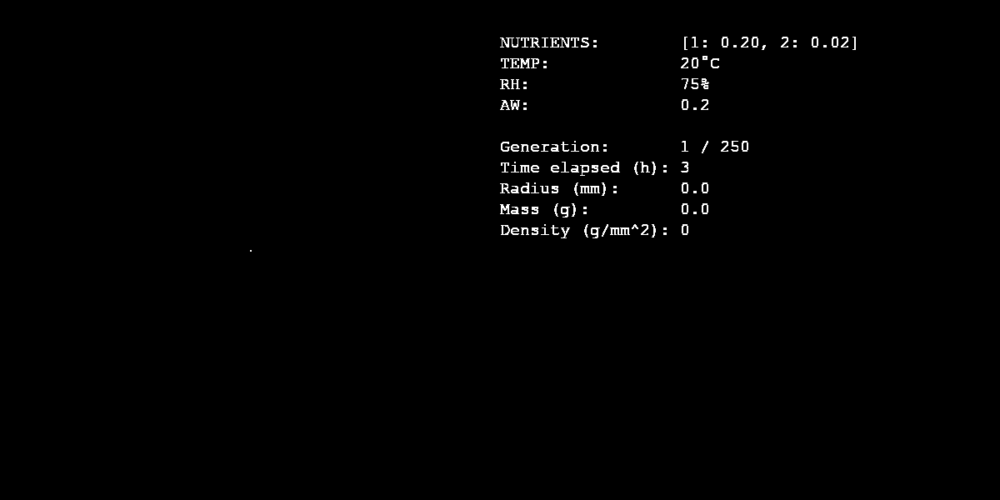

### Example

### References
- *Cellular automata simulations of fungal growth on solid substrates* by JOSEPH A. LASZLO and ROBERT W. SILMAN.
- *Nutrient concentrations, percentage moisture and density of field-collected fungal mycelia* by D. J. LODGE
- *Laboratory studies on the relationship between fungal growth and atmospheric temperature and humidity* by A.-L. Pasanen, P. Kalliokoski, P. Pasanen, M.J. Jantunen and A. Nevalainen

